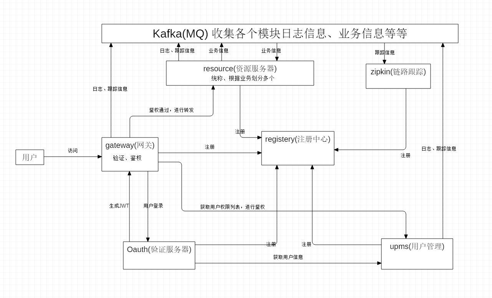

# spring-cloud-barrel
## 概要
- 对分布式微服务进行了一些探索，也为记录学习springcloud的一些笔记。
- 各个模块基于springcloud搭建

## 组成
### 模块
- common 公共模块，放置工具以及通用类
- registery 注册中心，采用spring-eureka
- gateway 网关，采用spring-zuul
- oauth 验证服务器，采用spring-oauth2
- zipkin 链路跟踪，采用spring-zipkin
- resource 资源服务器
- upms 用户权限管理

### 架构图

日常更新...

